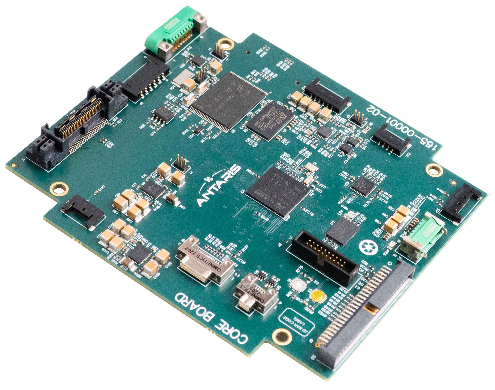

# Antaris Satellite Design Library

This repo contains the Antaris(TM) Satellite Design Library, developed by [Antaris, Inc](https://www.antaris.space/).
The Antaris team believes that by sharing this platform with the world, the space domain becomes less opaque and more accessible to all.
The included components have been designed for use with [Antaris SatOS(TM)](https://www.antaris.space/platform), yet are compatible with any desired flight software.

## License Terms

These assets are made available under the terms of the CERN Open Hardware License ([CERN-OHL-P v2](./LICENSE)).
Everything here is provided without any guarantee or warranty, and any use is at your own risk.

## Trademark Usage

Use of the Antaris trademark and/or logo is prohbited without written consent provided by Antaris, Inc.

## Components

### Core Board (Gen 1)

Main MCU (STM32) is mounted on this board, where the flight software operates.
The MCU connects with ADCS, S-band, X-band, EPS, thruster and other essential subsystems.
This OBC also has interconnectivity with payload and edge compute nodes.
This component was first used aboard JANUS-1.

* [Schematic](./components/core_gen1/820-00001-02_schematic.pdf)
* [Bill of Materials](./components/core_gen1/BOM-820-00001-02.xlsx)
* [Layout](./components/core_gen1/820-00001-02_Design_Schematic_Layout.rar)
* [Assembly](./components/core_gen1/ASY-820-00001-02.rar)
* [Gerber](./components/core_gen1/FAB-820-00001-02.rar)

## Feedback

Please engage with the maintainers here through issues and pull requests.
If you would like to reach out directly, feel free to send a message to opensource@antaris.space
